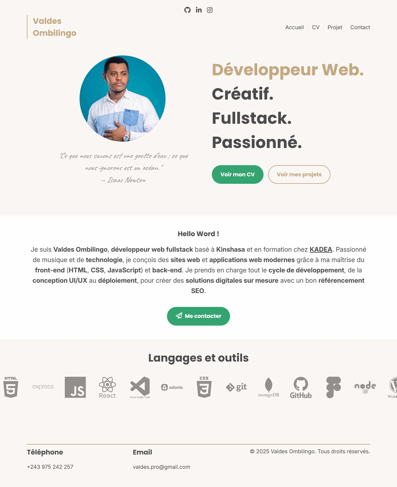

# 🌐 Portfolio - Valdes Ombilingo (HTML & CSS)

Bienvenue sur mon portfolio personnel !  
Je suis **Valdes Ombilingo**, développeur web fullstack en formation à **KADEA** (Kinshasa Digital Academy), passionné par la technologie, la création digitale et la musique.  
Ce site vitrine présente mes compétences, mon parcours et mes projets réalisés avec **HTML, CSS** et **Figma**.

---

## 🛠 Technologies utilisées

- 💻 **HTML5** – structure sémantique
- 🎨 **CSS3** – design responsive, Transition, animations, variables CSS
- 🧩 **Figma** – création de maquettes web
- ⚙️ Méthodes : responsive design, Desktop-first

---

## 📁 Structure du projet

Le site est composé de 4 pages principales :

- `index.html` – Page d’accueil
- `cv.html` – Curriculum vitae
- `projets.html` – Mes réalisations
- `contact.html` – Formulaire de contact

📦 Les styles sont répartis entre :

- `style.css` – Design desktop
- `responsive.css` – Adaptation mobile et tablette

---

## 🎯 Objectifs du projet

- Mettre en pratique mes compétences en HTML, CSS et Figma
- Créer un site responsive moderne, structuré et professionnel
- Présenter mes projets de manière claire
- Offrir un support à mes candidatures et démarches professionnelles

---

## 🖼️ Aperçu

---

## 📬 Contact

- 📧 **Email** : [valdes.pro@gmail.com](mailto:valdes.pro@gmail.com)
- 💼 **LinkedIn** : [valdes-ombilingo](https://www.linkedin.com/in/valdes-ombilingo-b94a72359/)
- 💻 **GitHub** : [valdesombilingo](https://github.com/valdesombilingo)

---

## 📝 Mentions

> Ce site est un projet personnel développé dans le cadre de ma formation à **KADEA**.  
> Il est mis en ligne pour valoriser mon profil, montrer mes compétences techniques et ma progression.

---

Merci pour votre visite ! 🙏🏼  
_#portfolio #html #css #figma #kadea #devweb_
